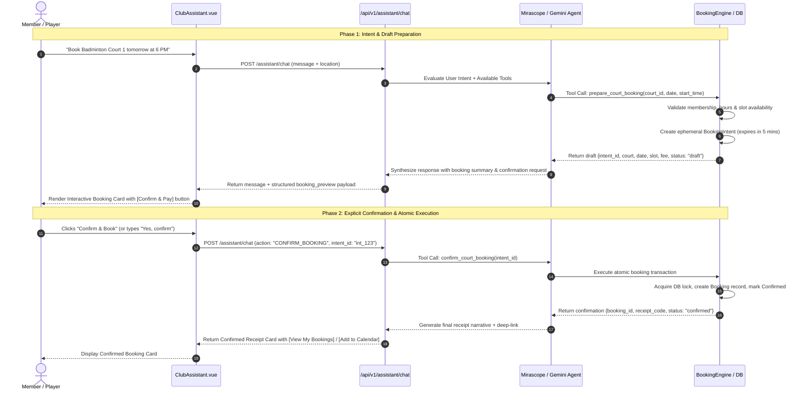
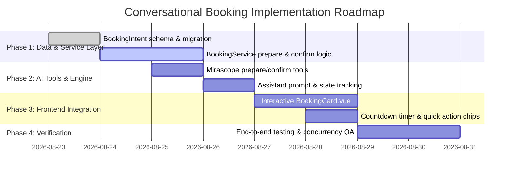

# ClubDash AI — Conversational Court Booking Architecture & Safety Plan

> **Scope:** Enable members and staff to discover, reserve, and manage court and facility bookings directly through conversational AI, while maintaining **zero double-bookings**, **explicit human-in-the-loop confirmation**, **financial/quota safety**, and **idempotent execution**.

---

## Table of Contents

1. [Executive Summary & Goals](#1-executive-summary--goals)
2. [Safety Hazards & Design Principles](#2-safety-hazards--design-principles)
3. [Target Architecture: The 2-Phase Confirmation Flow](#3-target-architecture-the-2-phase-confirmation-flow)
4. [Data Model Enhancements: Booking Intent & Soft Holds](#4-data-model-enhancements-booking-intent--soft-holds)
5. [Backend AI Tool Specifications (Mirascope)](#5-backend-ai-tool-specifications-mirascope)
6. [Concurrency & Double-Booking Prevention](#6-concurrency--double-booking-prevention)
7. [Intent State Machine & Session Lifecycle](#7-intent-state-machine--session-lifecycle)
8. [Frontend UX & Interactive Booking Cards](#8-frontend-ux--interactive-booking-cards)
9. [Edge Cases & Error Handling](#9-edge-cases--error-handling)
10. [Implementation Roadmap](#10-implementation-roadmap)
11. [Security & Compliance Checklist](#11-security--compliance-checklist)

---

## 1. Executive Summary & Goals

Currently, the ClubDash AI Assistant is **read-only**: it can recommend clubs, search availability, and check user schedules.
To transform it into an actionable concierge, users should be able to say:

> *"Book Badminton Court 1 for tomorrow at 6 PM"*
> or
> *"Find the nearest chlorine-free pool and reserve a 1-hour slot this Saturday morning."*

### Key Objectives:
- **Zero Accidental Bookings:** No transaction occurs without explicit, unambiguous user confirmation.
- **Race Condition Immunity:** Prevent double-booking if two users or an AI agent attempt to book the same slot simultaneously.
- **Quota & Membership Enforcement:** Validate membership active status, club access rights, and booking limits prior to confirmation.
- **Seamless UI Interactivity:** Combine conversational responses with rich interactive Vue 3 action cards (One-Click "Confirm Booking" buttons).

---

## 2. Safety Hazards & Design Principles

| Potential Hazard | Impact | Mitigation Strategy |
| :--- | :--- | :--- |
| **LLM Hallucination** | Bot claims a slot is booked when it failed, or books the wrong date/court. | Never allow the LLM to commit bookings directly without backend validation. All dates/times are validated strictly via backend schema. |
| **Premature Execution** | User asks *"Can I book court 2 at 4 PM?"* and the bot treats it as a purchase order. | **Two-Phase Commit (Prepare $\to$ Confirm)**: Step 1 generates a preview draft; Step 2 requires explicit user approval. |
| **Double Booking / Race Condition** | Two players book the same slot concurrently. | Database-level unique constraint (`court_id + date + start_time`) combined with atomic transactions / optimistic locking. |
| **Session Injection / Impersonation** | Malicious user forces bot to book on behalf of another member. | Hardcoded session identity: `user_id` is extracted strictly from the JWT token, never from conversational parameters. |
| **Stale Availability** | Slot was available when bot recommended it, but taken 2 minutes later when confirming. | 5-minute soft lock (intent hold) with automatic expiration and real-time availability re-check on confirmation. |

---

## 3. Target Architecture: The 2-Phase Confirmation Flow



---

## 4. Data Model Enhancements: Booking Intent & Soft Holds

To ensure reliability without cluttering the primary `bookings` table with aborted drafts, we introduce a lightweight `BookingIntent` model:

### `backend/app/bookings/models.py`

```python
class BookingIntent(db.Model):
    __tablename__ = 'booking_intents'

    id = db.Column(db.String(36), primary_key=True)  # UUID e.g. "int_8f9a2b..."
    user_id = db.Column(db.Integer, db.ForeignKey('users.id'), nullable=False)
    court_id = db.Column(db.Integer, db.ForeignKey('courts.id'), nullable=False)
    booking_date = db.Column(db.Date, nullable=False)
    start_time = db.Column(db.Time, nullable=False)
    end_time = db.Column(db.Time, nullable=False)
    status = db.Column(db.String(20), default='pending')  # pending, confirmed, expired, cancelled
    expires_at = db.Column(db.DateTime, nullable=False)    # UTC now + 5 minutes
    created_at = db.Column(db.DateTime, default=datetime.utcnow)

    user = db.relationship('User')
    court = db.relationship('Court')
```

---

## 5. Backend AI Tool Specifications (Mirascope)

We equip the AI agent with 3 dedicated tools in `backend/app/assistant/tools.py`:

### Tool 1: `prepare_court_booking`
Prepares a draft booking, verifies club hours and conflicts, and returns a verified preview with an expiration timer.

```python
@llm.tool
def prepare_court_booking(
    court_id: int,
    target_date: str,       # Format: YYYY-MM-DD
    start_time_str: str     # Format: HH:MM (e.g. "18:00")
) -> str:
    """
    Validate slot availability and create a temporary 5-minute booking draft.
    Does NOT finalize payment or charge the user.
    Returns preview summary with intent_id for user confirmation.
    """
    ...
```

### Tool 2: `confirm_court_booking`
Finalizes the draft into a real confirmed booking once the user confirms.

```python
@llm.tool
def confirm_court_booking(intent_id: str) -> str:
    """
    Atomically confirm and commit a previously prepared booking draft.
    Requires a valid, non-expired intent_id.
    """
    ...
```

### Tool 3: `cancel_my_booking`
Allows the user to cancel one of their upcoming confirmed bookings through conversation.

```python
@llm.tool
def cancel_my_booking(booking_id: int) -> str:
    """
    Cancel an existing booking belonging to the authenticated user.
    Enforces club cancellation policy (e.g. must be > 2 hours before start).
    """
    ...
```

---

## 6. Concurrency & Double-Booking Prevention

To eliminate race conditions when multiple users (or parallel requests) attempt to book the exact same slot:

1. **Database-Level Unique Constraint**:
   ```sql
   ALTER TABLE bookings ADD CONSTRAINT uq_court_slot 
   UNIQUE (court_id, booking_date, start_time);
   ```
2. **Atomic Transaction with Integrity Error Handling**:
   ```python
   try:
       with db.session.begin_nested():
           # Check for active conflicting bookings
           conflict = Booking.query.filter(
               Booking.court_id == intent.court_id,
               Booking.booking_date == intent.booking_date,
               Booking.start_time == intent.start_time,
               Booking.status.in_(['confirmed', 'pending'])
           ).with_for_update().first()

           if conflict:
               return {"error": "This slot was just booked by another member. Please choose another time."}, 409

           booking = Booking(
               user_id=intent.user_id,
               court_id=intent.court_id,
               booking_date=intent.booking_date,
               start_time=intent.start_time,
               end_time=intent.end_time,
               status='confirmed'
           )
           db.session.add(booking)
           intent.status = 'confirmed'
       db.session.commit()
   except IntegrityError:
       db.session.rollback()
       return {"error": "Slot unavailable. Please select another slot."}, 409
   ```

---

## 7. Intent State Machine & Session Lifecycle

```
┌─────────────────┐
│ User Request    │
└────────┬────────┘
         ▼
┌─────────────────┐       Validation Failed
│ PREPARE_DRAFT   ├──────────────────────────────► [ Suggest Alternative Slot ]
└────────┬────────┘
         │ Valid Slot
         ▼
┌─────────────────┐       5 Minutes Inactivity
│ PENDING_CONFIRM ├──────────────────────────────► [ Intent Expired ]
└────────┬────────┘
         │
         ├── User says "No" / "Cancel" ──────────► [ Intent Cancelled ]
         │
         └── User clicks "Confirm & Book"
                 │
                 ▼
         ┌─────────────────┐
         │ CONFIRMED       │ ──► Generates Booking ID & Calendar Event
         └─────────────────┘
```

---

## 8. Frontend UX & Interactive Booking Cards

When `prepare_court_booking` succeeds, the backend returns a structured `booking_intent` payload alongside the assistant message.

### UI Mockup in `ClubAssistant.vue`:

```
┌────────────────────────────────────────────────────────┐
│ 🤖 Assistant                                           │
│ I've prepared your booking. Please review and confirm: │
│                                                        │
│ ┌────────────────────────────────────────────────────┐ │
│ │ 🏸 Badminton Court 1                               │ │
│ │ 📍 ClubDash Central Arena                          │ │
│ │ 📅 Saturday, Aug 23, 2026                          │ │
│ │ ⏰ 06:00 PM – 07:00 PM (1 Hour)                    │ │
│ │ 💳 Status: Ready to confirm (Hold expires in 4:42) │ │
│ │                                                    │ │
│ │ [ ✅ Confirm & Book Now ]   [ ❌ Cancel ]          │ │
│ └────────────────────────────────────────────────────┘ │
└────────────────────────────────────────────────────────┘
```

### Interactive Features:
1. **Countdown Timer Badge**: Displays remaining time on the 5-minute hold.
2. **One-Click Execution**: Clicking `Confirm & Book` sends a structured action payload directly to the backend.
3. **Deep Linking**: Once confirmed, provides a `View in My Bookings` button navigating to `/bookings`.

---

## 9. Edge Cases & Error Handling

| Scenario | System Behavior |
| :--- | :--- |
| **Slot Booked During 5-Min Window** | Transaction aborts gracefully; bot notifies user: *"Apologies, that slot was just taken. Here are the next closest available times on that court: [19:00, 20:00]"*. |
| **Past Date / Time Requested** | Bot clarifies: *"You cannot book a slot in the past. Today is 2026-08-22. Would you like to book for today or tomorrow?"*. |
| **Booking Outside Operating Hours** | Bot checks club opening/closing hours and suggests the earliest or latest valid slot. |
| **Membership Quota Exceeded** | Bot notifies user of their plan limit and provides a link to upgrade membership. |
| **Unclear Court or Time** | Bot prompts for clarification with quick options (e.g. *"Did you mean Badminton Court 1 or Court 2?"*). |

---

## 10. Implementation Roadmap



---

## 11. Security & Compliance Checklist

- [x] **Strict User Attribution**: All bookings derive `user_id` from JWT session identity.
- [x] **No Autonomous Financial Commits**: No charge or booking occurs without explicit secondary confirmation.
- [x] **Audit Trail**: Every booking records `source: "ai_assistant"` in metadata for operational auditing.
- [x] **Rate Limiting**: Apply max 10 booking intent requests per minute per user to prevent reservation spamming.
- [x] **Idempotency Keys**: Each booking intent generates a unique UUID to prevent double-charging on duplicate clicks.
