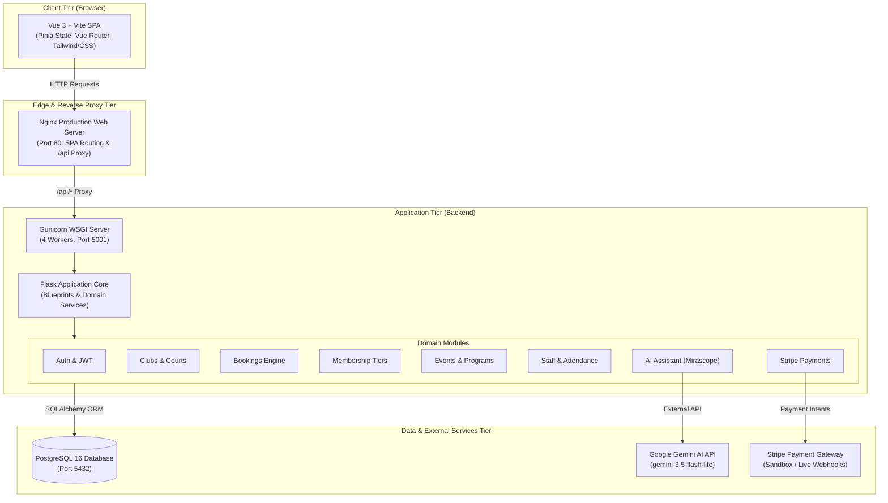

# Clubeon — System Architecture & Topology Specification

> **Platform**: Clubeon Sports Facility & Club Management  
> **Architecture Pattern**: Modular Monolith with Decoupled SPA  
> **Target Environment**: Docker Containerized / Production WSGI  

---

## 1. High-Level Architecture Overview

Clubeon is architected as a modular monolith designed for sports clubs, fitness centers, and athletic facilities. The application decouples the client-side presentation layer (Vue 3 Single Page Application) from the backend business logic and database persistence layer (Flask REST API + PostgreSQL).



---

## 2. Infrastructure & Container Topology

The entire platform is orchestratable via Docker Compose across three isolated network services:

| Service | Container Name | Base Image | Port | Description |
| :--- | :--- | :--- | :--- | :--- |
| **Frontend** | `clubeon-frontend` | `node:20-alpine` $\rightarrow$ `nginx:alpine` | `80:80` | Multi-stage production build serving static assets with SPA fallback routing. |
| **Backend** | `clubeon-backend` | `python:3.11-slim` | `5001:5001` | Gunicorn WSGI container running Alembic database migrations on startup. |
| **Database** | `clubeon-db` | `postgres:16-alpine` | `127.0.0.1:5432:5432` | Relational database with persistent volume storage (`pgdata`). |

---

## 3. Security & Governance Principles

1. **Authentication & Authorization**:
   - Authentication is powered by JSON Web Tokens (JWT) stored in `HttpOnly`, `SameSite=Lax` cookies to prevent Cross-Site Scripting (XSS) token theft.
   - Role-Based Access Control (RBAC) enforces distinct capabilities across **Player**, **Staff / Front-Desk**, and **Admin / Owner** roles.
2. **CORS Governance**:
   - Cross-Origin Resource Sharing is strictly constrained to explicit frontend origins (`http://localhost`, `http://localhost:5173`, `http://localhost:80`).
   - Wildcard `*` origins are prohibited when credentials (cookies) are active.
3. **Secret Isolation**:
   - Real environment variables and API keys reside exclusively in local/server `.env` files and are untracked by Git.
   - A sanitized `.env.example` file provides developer onboarding schemas with safe placeholders.
4. **Automated CI/CD Quality Gate**:
   - GitHub Actions workflow (`.github/workflows/ci.yml`) executes on all Pull Requests targeting `develop` and `main`.
   - Pipeline stages include Python linting, Pytest suite execution, Node dependency installation, and production Vite compilation.

---

## 4. Domain Module Surface

```
backend/app/
├── admin/          # Club management, court CRUD, member rosters, analytics
├── analytics/      # Utilization rates, revenue aggregation, attendance metrics
├── assistant/      # LLM conversational concierge, natural language booking
├── attendance/     # Player check-ins, staff timesheets, attendance logs
├── auth/           # JWT issuance, password hashing (bcrypt), user profiles
├── availability/   # Court availability calculation, time slot conflicts
├── bookings/       # Slot reservations, cancellation workflows, booking intents
├── clubs/          # Club facilities, courts, amenities, geospatial coordinates
├── events/         # Community tournaments, coaching clinics, participant lists
├── memberships/    # Tiered membership subscriptions (Monthly, Quarterly, Annual)
├── notifications/  # System alerts, booking confirmations, reminders
└── payments/       # Stripe checkout sessions, webhooks, fulfillment logic
```

---

## 5. Diagnostic & Monitoring Endpoints

* **`GET /health`**: Lightweight liveness probe returning HTTP 200 for container orchestrators.
* **`GET /api/health`**: Deep readiness probe verifying active PostgreSQL database connectivity and UTC timestamps.
* **`GET /api/status`**: Service discovery endpoint reporting platform version, enabled feature flags, and active runtime environment.
* **`GET /api/docs`**: Interactive Swagger UI rendering OpenAPI 3.0 specification.
